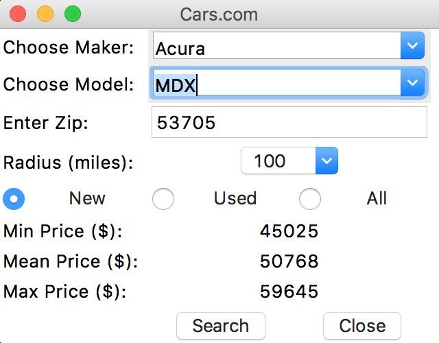
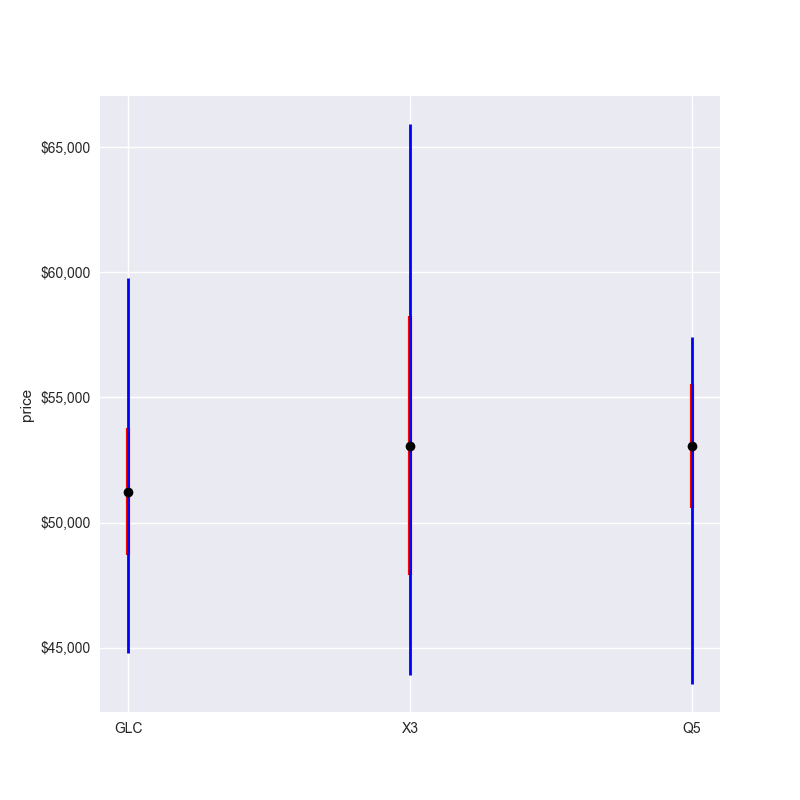
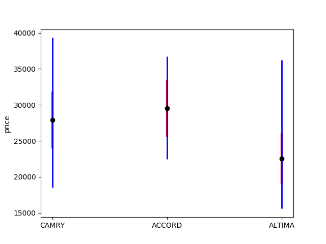
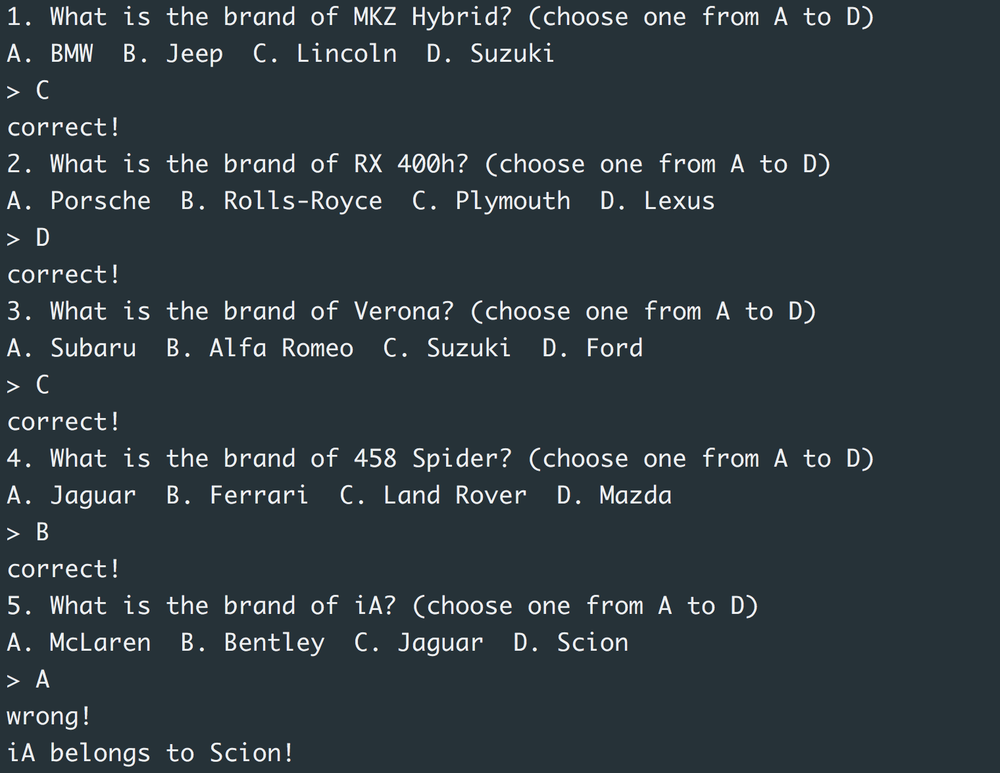

# Crawler for cars.com
A python crawler which can crawl car information from [cars.com](https://www.cars.com). It supports
python 3.6+.
The below libraries are needed.

* Beautiful Soup 4
* pandas
* numpy
* matplotlib


*Update (04-29-18)*

cars.com changed the html page slightly. The previous python crawler does not work. I have fixed it.

*Update (04-06-18)*

Add a simple GUI using Python TKinter.



You could launch GUI with

```
python GUI/gui.py
```

*Usage*:
1. Cars crawling: crawl cars of a specific model (e.g. Audi Q7) on cars.com and analyze prices.
```
bash crawling.sh
```

For example, crawl Audi Q3 within 100 miles from 53715 gives you the below information
```
Some Price Information (AUDI-Q3-NEW):
min price    = $ 35,950.00
mean price   = $ 41,683.36
median price = $ 41,660.00
max price    = $ 45,150.00
std price    = $ 2,025.90

```

2. Multiple crawl: crawl multiple car models listed in a file on cars.com and plot price comparison
```
bash multiple-crawling.sh
```
For example, crawl Audi Q5, BMW X3 and Benz GLC gives you the below plot.
Black dot denotes the mean price; red line denotes the standard deviation; Blue line shows
the the maximum and minimum price.


Also see the comparison of mid-size sedan of Japanese big three.



3. Brand guess game: a command line car brand guessing game
```
bash brand-guess-game.sh
```

